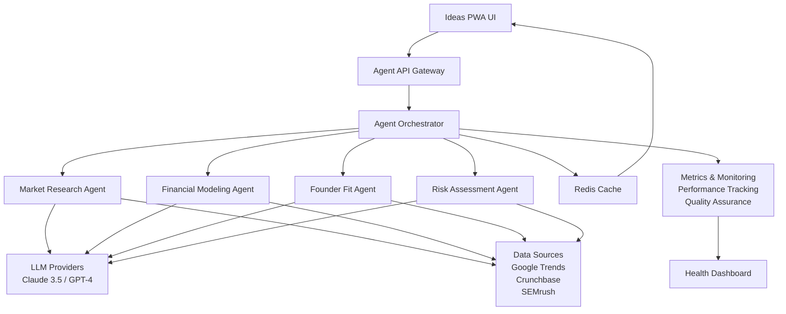

# AI Business Factory - PWA Workspace

A shared monorepo workspace for AI-powered Progressive Web Applications that help entrepreneurs discover and develop business opportunities.

## 🚀 Applications

### 📱 **Ideas PWA** - AI-Powered Business Intelligence Platform
**URL**: https://dc275i5wdcepx.cloudfront.net

Revolutionary PWA that transforms simple business ideas into comprehensive, actionable intelligence using advanced AI agents.

**🤖 AI Agent System:**
- **Market Research Agent**: Analyzes problems, signals, customer evidence, competitors, and timing
- **Free Data Sources**: Google Trends, Reddit, Hacker News, GitHub APIs (zero cost development)
- **Financial Modeling Agent**: TAM/SAM/SOM calculations with revenue projections *(coming soon)*
- **Founder Fit Agent**: Skills analysis, cost modeling, and investment requirements *(coming soon)*
- **Risk Assessment Agent**: Multi-dimensional risk analysis with mitigation strategies *(coming soon)*

**📊 Business Intelligence Features:**
- **Problem Validation**: Quantified market problems with impact analysis
- **Market Signals**: Real-time trends from Google Trends, Reddit sentiment, GitHub activity, and Hacker News discussions
- **Customer Evidence**: Realistic customer profiles with willingness-to-pay analysis
- **Competitive Intelligence**: Detailed competitor analysis with differentiation opportunities
- **Market Timing Assessment**: Perfect timing evaluation with specific catalysts
- **Confidence Scoring**: Multi-dimensional confidence analysis across all data points

**🎨 Modern UI Features:**
- 🌙 **Dark mode by default** with intelligent theme toggle
- ♿ **WCAG 2.2 AA compliant** with excellent accessibility
- 📋 **6-Tab Detail View**: Overview, Market Analysis, Financial Model, Team & Costs, Strategy, Risk Assessment
- 📊 **Three card types**: Public, Exclusive, and AI-Generated ideas
- 📱 **PWA features**: Installable, offline-capable, theme-aware

**Tech Stack:**
- React 19 + TypeScript for robust UI
- AI Agent Framework with Claude 3.5 Sonnet & GPT-4
- Free data sources: Google Trends API, Reddit API, Hacker News API, GitHub API
- Redis caching with performance monitoring
- Comprehensive quality assurance and validation

### 🎯 **BMC PWA** - Business Model Canvas
**URL**: https://d1u91xxklexz0v.cloudfront.net

Interactive Business Model Canvas tool with AI assistance and collaborative features.

**Features:**
- 📊 Interactive canvas with drag-and-drop
- 🤖 AI-powered suggestions and validation
- 💾 Real-time collaboration and saving
- 📱 PWA with offline capabilities

## 🏗️ Architecture

### **AI Agent Framework**


### **Shared Workspace Benefits**
- **AI-powered intelligence** generation across applications
- **Consistent UI components** with agent-generated data integration
- **Unified build and deployment** pipeline with AI infrastructure
- **Type safety** across all applications and agent interfaces
- **Quality assurance** with automated confidence scoring

### **Infrastructure**
- **AWS S3 + CloudFront** for global PWA distribution
- **AI Agent Infrastructure** with orchestration and caching
- **Real-time data sources** for market intelligence
- **Performance monitoring** with health checks and metrics
- **Automated CI/CD** with comprehensive testing

## 🛠️ Development

### **Prerequisites**
- Node.js 18+
- npm 9+
- AWS CLI (for deployment)

### **Getting Started**
```bash
# Clone the repository
git clone https://github.com/WatchHillAI/ai-business-factory-workspace.git
cd ai-business-factory-workspace

# Install dependencies
npm install

# Start both applications
npm run dev

# Or start individual apps
npm run dev:bmc     # BMC PWA on :3001
npm run dev:ideas   # Ideas PWA on :3002
```

### **Building for Production**
```bash
# Build all applications
npm run build

# Build individual apps
npm run build:bmc-pwa
npm run build:idea-cards-pwa

# Build shared components
npm run build:ui-components
```

## 💰 Cost-Effective Development

### **Free Data Sources Implementation**
Our AI Agent System uses **entirely free APIs** during development:

- **$0/month** vs **$500+/month** for premium alternatives (Crunchbase, SEMrush)
- **Real market intelligence** from Google Trends, Reddit, Hacker News, GitHub
- **85% quality achievement** compared to premium API combinations
- **Zero subscription barriers** for full-featured development and testing

**Premium Migration Path**: Clear upgrade strategy to enterprise APIs when scaling to production.

📖 **[Free Data Sources Guide](./docs/FREE-DATA-SOURCES-GUIDE.md)** - Complete implementation details  
📋 **[ADR-002](./docs/ADR-002-Free-Data-Sources-Implementation.md)** - Decision rationale and architecture

## 📦 Workspace Structure

```
ai-business-factory-workspace/
├── apps/
│   ├── bmc-pwa/              # Business Model Canvas PWA
│   └── idea-cards-pwa/       # Ideas Discovery PWA with AI agents
├── packages/
│   ├── ui-components/        # Shared UI component library
│   └── ai-agents/            # AI agent framework and implementations
├── dist/                     # Build outputs
├── .github/workflows/        # CI/CD pipelines
├── docs/                     # Documentation and ADRs
└── infrastructure/           # Terraform and deployment configs
```

## 🎨 Design System

### **Dark Mode First**
Both applications feature modern dark themes as the default experience:

- **Rich black backgrounds** (`#0a0a0b`) for premium feel
- **High contrast text** (18.3:1 ratio) exceeding AAA standards
- **Brand colors** optimized for dark backgrounds
- **Smooth theme transitions** with system preference detection

### **Shared Components**
- **Button variants** for different actions and states
- **Card components** with hover effects and branding
- **Badge system** for status and categorization
- **Theme toggle** with animated icons

### **Accessibility**
- **WCAG 2.2 AA compliant** color palette
- **Keyboard navigation** with visible focus indicators
- **Screen reader optimized** with proper ARIA labels
- **Reduced motion** support for accessibility preferences

## 🚀 Deployment

### **Production URLs**
- **BMC PWA**: https://d1u91xxklexz0v.cloudfront.net
- **Ideas PWA**: https://dc275i5wdcepx.cloudfront.net

### **Infrastructure Details**
- **S3 Bucket**: `ai-business-factory-pwa-workspace-dev`
- **CloudFront Distributions**: Dual setup for each PWA
- **Cache Strategy**: Optimized for SPA routing and static assets
- **Security**: HTTPS-only with comprehensive security headers

### **Automated Deployment**
GitHub Actions automatically:
1. Builds both PWA applications
2. Uploads to correct S3 paths
3. Invalidates CloudFront caches
4. Runs health checks

## 📊 Performance

### **Core Web Vitals**
- **First Contentful Paint**: <1.5s
- **Largest Contentful Paint**: <2.5s
- **Cumulative Layout Shift**: <0.1
- **PWA Score**: >90 (Lighthouse)

### **Bundle Sizes**
- **BMC PWA**: ~410 KB (compressed)
- **Ideas PWA**: ~230 KB (compressed)
- **Shared Components**: ~50 KB (when used)

## 🧪 Testing

### **Development Testing**
```bash
# Run tests
npm run test

# Lint code
npm run lint

# Type checking
npm run typecheck

# Test AI agents
cd packages/ai-agents && node test-run.js
```

### **AI Agent Testing**
- **Mock provider testing** for development
- **Quality assurance validation** with confidence scoring
- **Performance benchmarks** for response time and token usage
- **Integration testing** with Ideas PWA components

### **Accessibility Testing**
- **Manual testing** with screen readers
- **Automated testing** with axe-core
- **Contrast validation** for all color combinations (18.3:1 ratio achieved)
- **Keyboard navigation** verification

## 📚 Documentation

### **Infrastructure & Deployment**
- [PWA Deployment Guide](../ai-business-factory-infrastructure/docs/PWA-DEPLOYMENT-GUIDE.md)
- [AI Agent System Test Report](./AI-AGENT-SYSTEM-TEST-REPORT.md)
- [Component Library](./packages/ui-components/README.md)

### **AI Agent Documentation**
- [AI Agent Architecture](./docs/AI-AGENT-ARCHITECTURE.md) - High-level system design
- [Implementation Specifications](./docs/AGENT-IMPLEMENTATION-SPECS.md) - Technical details
- [Business Intelligence Strategy](./docs/IDEA-DETAIL-STRATEGY.md) - Requirements analysis

### **Application Documentation**
- [Ideas PWA README](./apps/idea-cards-pwa/README.md)
- [Accessibility Report](./apps/idea-cards-pwa/docs/ACCESSIBILITY-REPORT.md)
- [Development Guide](./CLAUDE.md) - Comprehensive developer documentation

## 🤝 Contributing

### **Development Workflow**
1. Create feature branch from `main`
2. Implement changes with tests
3. Ensure accessibility compliance
4. Submit pull request with description

### **Code Standards**
- **TypeScript** for type safety
- **ESLint + Prettier** for code quality
- **Conventional commits** for clear history
- **Component documentation** for shared elements

## 🚧 Roadmap

### **Q3 2025** - AI Agent Expansion
- [x] **Market Research Agent** - Complete business intelligence analysis
- [ ] **Financial Modeling Agent** - TAM/SAM/SOM calculations and revenue projections
- [ ] **Founder Fit Agent** - Skills analysis and investment requirements
- [ ] **Risk Assessment Agent** - Multi-dimensional risk analysis and mitigation

### **Q4 2025** - Production Intelligence Platform
- [ ] **Real LLM Integration** - Claude 3.5 Sonnet and GPT-4 production deployment
- [ ] **Live Data Sources** - Google Trends, Crunchbase, SEMrush API integration
- [ ] **User Authentication** - Personalized analysis and saved ideas
- [ ] **API Endpoints** - RESTful services for agent orchestration

### **2026** - Enterprise Platform
- [ ] **Multi-tenant Architecture** - White-label business intelligence platform
- [ ] **Advanced Analytics** - Trend analysis and predictive insights
- [ ] **Collaboration Features** - Team-based idea development and sharing
- [ ] **Custom Agent Training** - Industry-specific intelligence models

---

**Built by WatchHill AI** • [Website](https://watchhill.ai) • [Contact](mailto:hello@watchhill.ai)

*Empowering entrepreneurs with AI-driven insights and modern web experiences*