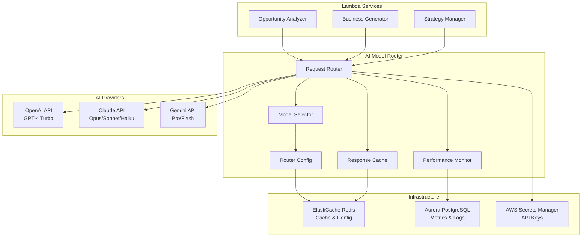

# AI Model Router - Technical Design

This document outlines the design and implementation of the AI Model Router, a centralized component for intelligently routing AI requests across multiple providers (OpenAI, Claude, Gemini) based on task requirements, cost optimization, and reliability.

## Architecture Overview



## Component Design

### 1. Request Router (Core Component)

```typescript
interface AIRequest {
  taskType: 'business_plan' | 'market_analysis' | 'sentiment_analysis' | 'general';
  prompt: string;
  context?: string;
  maxTokens?: number;
  temperature?: number;
  priority: 'low' | 'medium' | 'high';
  userId?: string;
  sessionId?: string;
}

interface AIResponse {
  content: string;
  model: string;
  provider: string;
  tokensUsed: number;
  cost: number;
  latency: number;
  cached: boolean;
  fallbackUsed: boolean;
}

class AIModelRouter {
  private modelSelector: ModelSelector;
  private responseCache: ResponseCache;
  private performanceMonitor: PerformanceMonitor;
  private providers: Map<string, AIProvider>;
  
  async route(request: AIRequest): Promise<AIResponse> {
    // 1. Check cache first
    const cached = await this.responseCache.get(request);
    if (cached) return cached;
    
    // 2. Select optimal model
    const selectedModel = await this.modelSelector.selectModel(request);
    
    // 3. Execute with fallback logic
    const response = await this.executeWithFallback(request, selectedModel);
    
    // 4. Cache response
    await this.responseCache.set(request, response);
    
    // 5. Record metrics
    await this.performanceMonitor.record(request, response);
    
    return response;
  }
  
  private async executeWithFallback(
    request: AIRequest, 
    modelConfig: ModelConfig
  ): Promise<AIResponse> {
    for (const model of modelConfig.models) {
      try {
        const provider = this.providers.get(model.provider);
        const response = await provider.generate(request, model);
        return { ...response, fallbackUsed: model !== modelConfig.models[0] };
      } catch (error) {
        console.warn(`Model ${model.name} failed:`, error);
        // Continue to next model in fallback chain
      }
    }
    throw new Error('All models in fallback chain failed');
  }
}
```

### 2. Model Selector (Intelligence Engine)

```typescript
interface ModelConfig {
  models: Array<{
    provider: 'openai' | 'claude' | 'gemini';
    name: string;
    priority: number;
    costPerToken: number;
    maxTokens: number;
    capabilities: string[];
  }>;
  reasoning: string;
}

class ModelSelector {
  private config: RouterConfig;
  
  async selectModel(request: AIRequest): Promise<ModelConfig> {
    const rules = await this.config.getRules();
    
    // Task-specific routing
    switch (request.taskType) {
      case 'business_plan':
        return this.selectForBusinessPlan(request, rules);
      case 'market_analysis':
        return this.selectForMarketAnalysis(request, rules);
      case 'sentiment_analysis':
        return this.selectForSentiment(request, rules);
      default:
        return this.selectGeneral(request, rules);
    }
  }
  
  private selectForBusinessPlan(request: AIRequest, rules: RouterRules): ModelConfig {
    const contextLength = (request.prompt + (request.context || '')).length;
    
    if (contextLength > 100000) {
      // Long context requires Claude
      return {
        models: [
          { provider: 'claude', name: 'claude-3-opus', priority: 1, costPerToken: 0.000075, maxTokens: 200000, capabilities: ['long_context', 'reasoning'] },
          { provider: 'openai', name: 'gpt-4-turbo', priority: 2, costPerToken: 0.00003, maxTokens: 128000, capabilities: ['reasoning'] }
        ],
        reasoning: 'Long context detected, Claude Opus preferred for 200K token support'
      };
    }
    
    if (request.priority === 'high') {
      return {
        models: [
          { provider: 'claude', name: 'claude-3-sonnet', priority: 1, costPerToken: 0.000015, maxTokens: 200000, capabilities: ['fast', 'reasoning'] },
          { provider: 'openai', name: 'gpt-4-turbo', priority: 2, costPerToken: 0.00003, maxTokens: 128000, capabilities: ['reasoning'] }
        ],
        reasoning: 'High priority request, Claude Sonnet for speed with OpenAI fallback'
      };
    }
    
    // Default business plan routing
    return {
      models: [
        { provider: 'claude', name: 'claude-3-opus', priority: 1, costPerToken: 0.000075, maxTokens: 200000, capabilities: ['reasoning', 'long_context'] },
        { provider: 'openai', name: 'gpt-4-turbo', priority: 2, costPerToken: 0.00003, maxTokens: 128000, capabilities: ['reasoning'] }
      ],
      reasoning: 'Business plan generation optimized for Claude reasoning capabilities'
    };
  }
  
  private selectForMarketAnalysis(request: AIRequest, rules: RouterRules): ModelConfig {
    return {
      models: [
        { provider: 'gemini', name: 'gemini-pro', priority: 1, costPerToken: 0.0000005, maxTokens: 1000000, capabilities: ['multimodal', 'real_time'] },
        { provider: 'claude', name: 'claude-3-sonnet', priority: 2, costPerToken: 0.000015, maxTokens: 200000, capabilities: ['analysis'] },
        { provider: 'openai', name: 'gpt-4-turbo', priority: 3, costPerToken: 0.00003, maxTokens: 128000, capabilities: ['analysis'] }
      ],
      reasoning: 'Market analysis benefits from Gemini multimodal and real-time capabilities'
    };
  }
  
  private selectForSentiment(request: AIRequest, rules: RouterRules): ModelConfig {
    if (rules.costOptimization && request.priority !== 'high') {
      return {
        models: [
          { provider: 'claude', name: 'claude-3-haiku', priority: 1, costPerToken: 0.00000025, maxTokens: 200000, capabilities: ['fast', 'cheap'] },
          { provider: 'openai', name: 'gpt-3.5-turbo', priority: 2, costPerToken: 0.000002, maxTokens: 16000, capabilities: ['fast'] }
        ],
        reasoning: 'Cost optimization enabled, using cheaper models for sentiment analysis'
      };
    }
    
    return {
      models: [
        { provider: 'openai', name: 'gpt-4-turbo', priority: 1, costPerToken: 0.00003, maxTokens: 128000, capabilities: ['sentiment'] },
        { provider: 'claude', name: 'claude-3-sonnet', priority: 2, costPerToken: 0.000015, maxTokens: 200000, capabilities: ['analysis'] }
      ],
      reasoning: 'High accuracy sentiment analysis with OpenAI proven performance'
    };
  }
}
```

### 3. Response Cache (Performance Optimization)

```typescript
class ResponseCache {
  private redis: RedisClient;
  private ttl: number = 3600; // 1 hour default
  
  async get(request: AIRequest): Promise<AIResponse | null> {
    const cacheKey = this.generateCacheKey(request);
    const cached = await this.redis.get(cacheKey);
    
    if (cached) {
      const response = JSON.parse(cached) as AIResponse;
      response.cached = true;
      return response;
    }
    
    return null;
  }
  
  async set(request: AIRequest, response: AIResponse): Promise<void> {
    const cacheKey = this.generateCacheKey(request);
    const ttl = this.calculateTTL(request);
    
    await this.redis.setex(cacheKey, ttl, JSON.stringify({
      ...response,
      cached: false
    }));
  }
  
  private generateCacheKey(request: AIRequest): string {
    // Create hash of request content for cache key
    const content = `${request.taskType}:${request.prompt}:${request.context || ''}`;
    return `ai_cache:${this.hash(content)}`;
  }
  
  private calculateTTL(request: AIRequest): number {
    switch (request.taskType) {
      case 'business_plan': return 24 * 3600; // 24 hours (stable content)
      case 'market_analysis': return 3600; // 1 hour (dynamic content)
      case 'sentiment_analysis': return 30 * 60; // 30 minutes (real-time)
      default: return this.ttl;
    }
  }
  
  private hash(content: string): string {
    // Use crypto.createHash for consistent hashing
    return require('crypto').createHash('sha256').update(content).digest('hex').slice(0, 16);
  }
}
```

### 4. Performance Monitor (Observability)

```typescript
interface PerformanceMetrics {
  requestId: string;
  taskType: string;
  model: string;
  provider: string;
  tokensUsed: number;
  cost: number;
  latency: number;
  success: boolean;
  fallbackUsed: boolean;
  timestamp: Date;
  userId?: string;
}

class PerformanceMonitor {
  private database: DatabaseClient;
  
  async record(request: AIRequest, response: AIResponse): Promise<void> {
    const metrics: PerformanceMetrics = {
      requestId: this.generateRequestId(),
      taskType: request.taskType,
      model: response.model,
      provider: response.provider,
      tokensUsed: response.tokensUsed,
      cost: response.cost,
      latency: response.latency,
      success: true,
      fallbackUsed: response.fallbackUsed,
      timestamp: new Date(),
      userId: request.userId
    };
    
    // Store in database for analysis
    await this.database.query(
      'INSERT INTO ai_model_metrics (request_id, task_type, model, provider, tokens_used, cost, latency, success, fallback_used, timestamp, user_id) VALUES ($1, $2, $3, $4, $5, $6, $7, $8, $9, $10, $11)',
      [metrics.requestId, metrics.taskType, metrics.model, metrics.provider, metrics.tokensUsed, metrics.cost, metrics.latency, metrics.success, metrics.fallbackUsed, metrics.timestamp, metrics.userId]
    );
    
    // Update real-time metrics in Redis
    await this.updateRealTimeMetrics(metrics);
  }
  
  private async updateRealTimeMetrics(metrics: PerformanceMetrics): Promise<void> {
    const redis = this.getRedisClient();
    const hour = new Date().toISOString().slice(0, 13); // YYYY-MM-DDTHH
    
    // Track requests per hour by provider
    await redis.incr(`metrics:${hour}:${metrics.provider}:requests`);
    await redis.incrbyfloat(`metrics:${hour}:${metrics.provider}:cost`, metrics.cost);
    await redis.incr(`metrics:${hour}:${metrics.provider}:tokens`, metrics.tokensUsed);
    
    // Track average latency
    await redis.lpush(`metrics:${hour}:${metrics.provider}:latency`, metrics.latency);
    await redis.ltrim(`metrics:${hour}:${metrics.provider}:latency`, 0, 999); // Keep last 1000 samples
  }
  
  async getProviderStats(timeframe: 'hour' | 'day' | 'week'): Promise<ProviderStats[]> {
    // Implementation for retrieving performance statistics
    // Used for cost optimization and model selection tuning
  }
}
```

## Implementation Strategy

### Phase 1: Core Router (Week 1)
1. **Create shared library** for AI Model Router
2. **Implement basic routing logic** with OpenAI and Claude
3. **Add to Business Generator Lambda** (lowest risk, highest value)
4. **Test with simple business plan generation**

### Phase 2: Enhanced Features (Week 2)
1. **Add Gemini integration** for Opportunity Analyzer
2. **Implement caching layer** with Redis
3. **Add performance monitoring** and metrics collection
4. **Test with market analysis workloads**

### Phase 3: Intelligence & Optimization (Week 3-4)
1. **Implement cost-based routing** with real-time optimization
2. **Add Strategy Manager integration** for configuration-driven routing
3. **Implement A/B testing** for model comparison
4. **Add automated fallback tuning** based on success rates

## Configuration Management

### Router Configuration Schema
```yaml
# Stored in Aurora PostgreSQL and cached in Redis
router_config:
  cost_optimization:
    enabled: true
    max_cost_per_request: 0.05
    daily_budget: 50.00
    
  model_preferences:
    business_plan:
      primary: "claude-3-opus"
      fallback: ["gpt-4-turbo", "claude-3-sonnet"]
      cost_threshold: 0.03
      
    market_analysis:
      primary: "gemini-pro"
      fallback: ["claude-3-sonnet", "gpt-4-turbo"]
      cost_threshold: 0.01
      
    sentiment_analysis:
      primary: "gpt-4-turbo"
      fallback: ["claude-3-haiku", "gpt-3.5-turbo"]
      cost_threshold: 0.005
      
  rate_limits:
    openai:
      requests_per_minute: 500
      tokens_per_minute: 40000
    claude:
      requests_per_minute: 4000
      tokens_per_minute: 400000
    gemini:
      requests_per_minute: 1000
      tokens_per_minute: 1000000
      
  cache_settings:
    business_plan_ttl: 86400  # 24 hours
    market_analysis_ttl: 3600  # 1 hour
    sentiment_ttl: 1800        # 30 minutes
```

## Deployment Architecture

### Lambda Integration
```typescript
// Usage in Lambda functions
import { AIModelRouter } from '@ai-business-factory/model-router';

export async function generateBusinessPlan(opportunity: Opportunity): Promise<BusinessPlan> {
  const router = new AIModelRouter();
  
  const response = await router.route({
    taskType: 'business_plan',
    prompt: `Generate a comprehensive business plan for: ${opportunity.title}`,
    context: JSON.stringify(opportunity),
    priority: 'high',
    userId: opportunity.userId
  });
  
  return {
    content: response.content,
    generatedBy: `${response.provider}:${response.model}`,
    cost: response.cost,
    tokensUsed: response.tokensUsed
  };
}
```

### Terraform Module
```hcl
# New Terraform module for AI Model Router shared library
module "ai_model_router" {
  source = "../../modules/ai-model-router-layer"
  
  layer_name = "ai-model-router"
  runtime    = "nodejs18.x"
  
  # Dependencies
  redis_endpoint = module.redis_cluster.cluster_address
  database_url   = module.postgresql_cluster.cluster_endpoint
  
  # API Keys from Secrets Manager
  openai_secret_arn = aws_secretsmanager_secret.openai_api_key.arn
  claude_secret_arn = aws_secretsmanager_secret.claude_api_key.arn
  gemini_secret_arn = aws_secretsmanager_secret.gemini_api_key.arn
  
  tags = local.common_tags
}

# Update Lambda functions to use the layer
resource "aws_lambda_function" "business_generator" {
  # ... existing configuration
  
  layers = [
    module.ai_model_router.layer_arn
  ]
  
  environment {
    variables = {
      AI_ROUTER_CONFIG = "production"
      REDIS_ENDPOINT   = module.redis_cluster.cluster_address
    }
  }
}
```

## Security Considerations

### API Key Management
- **Separate secrets** for each AI provider in AWS Secrets Manager
- **Least privilege IAM** policies for Lambda access to secrets
- **Rotation support** for API keys with zero-downtime updates
- **Audit logging** of all API key usage

### Request Validation
- **Input sanitization** to prevent prompt injection attacks
- **Rate limiting** per user/session to prevent abuse
- **Content filtering** for sensitive information in prompts
- **Request size limits** to prevent resource exhaustion

### Response Security
- **Content scanning** for sensitive information in responses
- **Audit trail** of all AI interactions for compliance
- **Encrypted storage** of cached responses
- **Data retention policies** for metrics and logs

## Cost Monitoring & Optimization

### Real-time Cost Tracking
```typescript
class CostMonitor {
  private dailyBudget: number = 50.00;
  private costThresholds = {
    warning: 0.8,  // 80% of budget
    critical: 0.95 // 95% of budget
  };
  
  async checkBudget(provider: string, estimatedCost: number): Promise<boolean> {
    const today = new Date().toISOString().slice(0, 10);
    const currentSpend = await this.getCurrentSpend(today);
    
    if (currentSpend + estimatedCost > this.dailyBudget) {
      await this.triggerBudgetAlert('EXCEEDED', currentSpend, estimatedCost);
      return false; // Block request
    }
    
    const percentage = (currentSpend + estimatedCost) / this.dailyBudget;
    if (percentage > this.costThresholds.critical) {
      await this.triggerBudgetAlert('CRITICAL', currentSpend, estimatedCost);
    } else if (percentage > this.costThresholds.warning) {
      await this.triggerBudgetAlert('WARNING', currentSpend, estimatedCost);
    }
    
    return true;
  }
}
```

### Cost Optimization Strategies
1. **Intelligent Caching**: Cache similar requests to reduce API calls
2. **Model Downgrading**: Use cheaper models when quality threshold is met
3. **Batch Processing**: Combine multiple requests where possible
4. **Off-peak Routing**: Route non-urgent requests to cheaper time slots
5. **Quality Feedback**: Learn which models provide sufficient quality for each task

## Testing Strategy

### Unit Tests
- **Mock AI providers** for deterministic testing
- **Test routing logic** with various input scenarios
- **Validate caching behavior** and TTL calculations
- **Test error handling** and fallback mechanisms

### Integration Tests
- **Real API testing** with test API keys and small requests
- **Performance benchmarking** of routing decisions
- **Cost validation** with actual provider billing
- **Failure scenario testing** (provider outages, rate limits)

### A/B Testing Framework
```typescript
class ABTestingFramework {
  async runModelComparison(
    taskType: string,
    testRequests: AIRequest[],
    models: string[]
  ): Promise<ComparisonResults> {
    // Split traffic between models
    // Measure quality, cost, and latency
    // Provide statistical significance testing
  }
}
```

## Success Metrics

### Performance KPIs
- **Response Time**: P95 latency < 5 seconds
- **Availability**: 99.9% uptime across all providers
- **Cost Efficiency**: 30% cost reduction vs. single-provider
- **Cache Hit Rate**: >60% for repeated similar requests

### Quality Metrics
- **Model Accuracy**: A/B testing against ground truth
- **User Satisfaction**: Feedback scoring for AI responses
- **Fallback Rate**: <10% fallback usage under normal conditions
- **Error Rate**: <1% failed requests after all fallbacks

---

## Next Steps

1. **Review this design** and create ADR-006 for implementation approach
2. **Create Terraform module** for AI Model Router Lambda layer
3. **Implement Phase 1** with Business Generator integration
4. **Set up monitoring** and cost tracking infrastructure

**Ready to proceed with implementation? Should we start with the Terraform module or the core router logic?**

---

*This design provides a robust, scalable, and cost-effective approach to multi-model AI integration that aligns with our serverless architecture principles.*