# AI Business Factory - Dependency Matrix

This document provides a comprehensive mapping of all dependencies across the AI Business Factory serverless platform, including service-to-service relationships, infrastructure dependencies, and external integrations.

## Service Dependency Overview

```mermaid
graph TD
    %% External Dependencies
    subgraph "External Services"
        OpenAI[OpenAI API<br/>GPT-4 Turbo]
        WebSources[Web Sources<br/>News, Social, Patents]
        AWS[AWS Services<br/>Managed Infrastructure]
    end

    %% Core Infrastructure
    subgraph "Data Layer"
        Aurora[Aurora PostgreSQL<br/>Serverless v1]
        Redis[ElastiCache Redis<br/>t3.micro]
        Secrets[AWS Secrets Manager<br/>Credentials]
    end

    %% Messaging & Events
    subgraph "Messaging Layer"
        SQS_Scraping[Scraping Queue<br/>SQS + DLQ]
        SQS_Analysis[Analysis Queue<br/>SQS + DLQ]
        SQS_Validation[Validation Queue<br/>SQS + DLQ]
        EventBridge[EventBridge<br/>Scheduled Rules]
    end

    %% API Layer
    subgraph "API Layer"
        AppSync[AppSync GraphQL<br/>Unified API]
        APIGateway[API Gateway<br/>Individual REST APIs]
    end

    %% Lambda Services
    subgraph "Lambda Services"
        DataCollector[Data Collector<br/>1024MB, 300s]
        Analyzer[Opportunity Analyzer<br/>2048MB, 900s]
        Validator[Market Validator<br/>1024MB, 600s]
        Strategy[Strategy Manager<br/>512MB, 60s]
        Scheduler[Scheduler<br/>512MB, 60s]
        Generator[Business Generator<br/>2048MB, 900s]
    end

    %% Client Applications
    subgraph "Client Layer"
        WebApp[Web Application<br/>React/Next.js]
        Mobile[Mobile App<br/>React Native]
        APIClients[API Clients<br/>Third-party]
    end

    %% Data flow dependencies
    DataCollector --> Aurora
    DataCollector --> Redis
    DataCollector --> SQS_Scraping
    DataCollector --> SQS_Analysis
    DataCollector --> WebSources

    %% Multi-model AI dependencies
    subgraph "AI Providers"
        Claude[Claude API<br/>Opus/Sonnet/Haiku]
        Gemini[Gemini API<br/>Pro/Flash]
        AIRouter[AI Model Router<br/>Intelligent Selection]
    end

    Analyzer --> Aurora
    Analyzer --> Redis
    Analyzer --> SQS_Analysis
    Analyzer --> AIRouter
    
    Validator --> Aurora
    Validator --> Redis
    Validator --> SQS_Validation

    Strategy --> Aurora
    Strategy --> Redis
    Strategy --> SQS_Scraping
    Strategy --> SQS_Analysis
    Strategy --> SQS_Validation
    Strategy --> AIRouter

    Scheduler --> SQS_Scraping
    Scheduler --> SQS_Analysis
    Scheduler --> SQS_Validation
    EventBridge --> Scheduler

    Generator --> Aurora
    Generator --> AIRouter
    
    AIRouter --> OpenAI
    AIRouter --> Claude  
    AIRouter --> Gemini

    %% API Layer connections
    AppSync --> Aurora
    AppSync --> Analyzer
    AppSync --> Validator
    AppSync --> Generator

    APIGateway --> DataCollector
    APIGateway --> Analyzer
    APIGateway --> Validator
    APIGateway --> Strategy
    APIGateway --> Scheduler

    %% Client connections
    WebApp --> AppSync
    WebApp --> APIGateway
    Mobile --> AppSync
    APIClients --> AppSync
    APIClients --> APIGateway

    %% Security
    DataCollector --> Secrets
    Analyzer --> Secrets
    Generator --> Secrets
```



## Detailed Dependency Matrix

### Lambda Service Dependencies

| Service | Database | Cache | Queues | External APIs | Infrastructure | Security |
|---------|----------|-------|--------|---------------|----------------|----------|
| **Data Collector** | Aurora (R/W) | Redis (Cache) | Scraping (Send)<br/>Analysis (Send) | Web Sources (HTTP) | API Gateway<br/>CloudWatch | Secrets Manager |
| **Opportunity Analyzer** | Aurora (R/W) | Redis (Cache) | Analysis (Receive) | AI Router<br/>(Gemini→Claude) | API Gateway<br/>AppSync<br/>CloudWatch | Secrets Manager |
| **Market Validator** | Aurora (R/W) | Redis (Cache) | Validation (Receive) | None | API Gateway<br/>AppSync<br/>CloudWatch | IAM Roles |
| **Strategy Manager** | Aurora (R/W) | Redis (Cache) | All Queues (Send) | AI Router<br/>(Config-driven) | API Gateway<br/>CloudWatch | IAM Roles |
| **Scheduler** | None | None | All Queues (Send) | None | EventBridge<br/>CloudWatch | IAM Roles |
| **Business Generator** | Aurora (R/W) | None | None | AI Router<br/>(Claude→OpenAI) | AppSync<br/>CloudWatch | Secrets Manager |

### Infrastructure Dependencies

#### AWS Managed Services
```yaml
Aurora PostgreSQL Serverless:
  Dependencies:
    - AWS Secrets Manager (credentials)
    - VPC Security Groups (network)
    - CloudWatch (monitoring)
  Dependents:
    - All Lambda services (database)
    - AppSync (direct resolvers)

ElastiCache Redis:
  Dependencies:
    - VPC Security Groups (network)
    - CloudWatch (monitoring)
  Dependents:
    - Data Collector (caching)
    - Opportunity Analyzer (ML cache)
    - Market Validator (validation cache)
    - Strategy Manager (config cache)

AppSync GraphQL API:
  Dependencies:
    - Aurora PostgreSQL (direct resolvers)
    - Lambda functions (Lambda resolvers)
    - IAM Roles (service access)
    - CloudWatch (logging)
  Dependents:
    - Web Application (GraphQL client)
    - Mobile Application (GraphQL client)
    - API Clients (third-party integrations)

SQS Queues:
  Dependencies:
    - CloudWatch (monitoring)
    - IAM Roles (access control)
  Dependents:
    - Data Collector (job publishing)
    - Opportunity Analyzer (job processing)
    - Market Validator (job processing)
    - Strategy Manager (job orchestration)
    - Scheduler (job scheduling)

EventBridge:
  Dependencies:
    - IAM Roles (Lambda invocation)
    - CloudWatch (rule monitoring)
  Dependents:
    - Scheduler (automated triggers)
```

## Service Communication Patterns

### 1. Data Collection Flow
```
Web Sources → Data Collector → [Aurora + Redis + SQS] → Opportunity Analyzer
```

### 2. Analysis Pipeline
```
SQS Analysis Queue → Opportunity Analyzer → [AI Router (Gemini/Claude) + Aurora] → AppSync (real-time)
```

### 3. Validation Pipeline
```
SQS Validation Queue → Market Validator → Aurora → AppSync (real-time)
```

### 4. Business Plan Generation
```
AppSync → Business Generator → [AI Router (Claude/OpenAI) + Aurora] → AppSync (response)
```

### 6. AI Model Routing
```
Lambda Service → AI Router → [Primary Model] → Success/Failure → [Fallback Model] → Response
```

### 5. Scheduled Automation
```
EventBridge → Scheduler → [SQS Queues] → Processing Services
```

## Critical Dependencies by Category

### 🔴 **Critical Path Dependencies (System Failure if Down)**

| Dependency | Impact | Services Affected | Mitigation |
|------------|--------|-------------------|------------|
| **Aurora PostgreSQL** | Complete data loss | All services | Multi-AZ, automated backups, point-in-time recovery |
| **AppSync GraphQL** | Client applications broken | Web, Mobile, API clients | API Gateway fallback, caching |
| **AI Model Router** | AI features unavailable | Analyzer, Generator | Multi-provider fallback, cached responses |
| **AWS Secrets Manager** | Authentication failure | Collector, Analyzer, Generator | IAM role fallback, local secrets (dev only) |

### 🟡 **Important Dependencies (Degraded Performance if Down)**

| Dependency | Impact | Services Affected | Mitigation |
|------------|--------|-------------------|------------|
| **ElastiCache Redis** | Slower response times | All caching services | Database fallback, TTL management |
| **SQS Queues** | Synchronous processing only | Async job processing | Direct invocation fallback |
| **API Gateway** | Individual service access limited | Legacy REST clients | AppSync GraphQL alternative |

### 🟢 **Monitoring Dependencies (Observability Impact Only)**

| Dependency | Impact | Services Affected | Mitigation |
|------------|--------|-------------------|------------|
| **CloudWatch** | No metrics/logs | All services | Local logging, external monitoring |
| **EventBridge** | No automated scheduling | Scheduler service | Manual triggering, external cron |

## External API Dependencies

### Multi-Model AI Strategy
```yaml
AI Model Integration (Multi-Provider Strategy):
  Business Plan Generation:
    Primary: Claude Opus (better reasoning, 200K context)
    Fallback: OpenAI GPT-4 Turbo (proven reliability)
    Use Case: Complex business strategy documents
    
  Market Analysis:
    Primary: Google Gemini Pro (multimodal, real-time data)
    Fallback: Claude Sonnet (structured analysis)
    Use Case: Data interpretation, trend analysis
    
  Sentiment Analysis:
    Primary: OpenAI GPT-4 (proven sentiment accuracy)
    Fallback: Claude Haiku (cost-effective)
    Future: Grok (real-time social data, when available)
    Use Case: Social media, news sentiment

Model Selection Strategy:
  Route by:
    - Task complexity (simple → cheaper models)
    - Context length requirements (long docs → Claude)
    - Real-time needs (fastest response)
    - Cost thresholds (auto-fallback when exceeded)
    - Rate limit management (distribute load)

Rate Limits (Combined):
  - OpenAI: 40,000 TPM, 500 RPM
  - Claude: 400,000 TPM, 4,000 RPM
  - Gemini: 1M TPM, 1,000 RPM
  - Total capacity: ~5,500 RPM across providers

Cost Optimization:
  - Task routing: Use cheapest appropriate model
  - Intelligent caching: Reduce redundant API calls
  - Batch processing: Combine similar requests
  - Cost monitoring: Real-time spend tracking

Security:
  Authentication: Multiple API keys via AWS Secrets Manager
  Network: HTTPS only, no VPC required
  Monitoring: Per-provider request/response logging
  Failover: Automatic model switching on errors
```

### Web Sources Integration
```yaml
Target Sources:
  - News APIs: Reuters, NewsAPI, Google News
  - Social Media: Twitter API, Reddit API
  - Patent Databases: USPTO, Google Patents
  - Research: arXiv, PubMed APIs

Rate Limiting:
  - Concurrent requests: 10 per source
  - Request delay: 1-5 seconds between requests
  - Daily limits: 1000-10000 requests per source

Error Handling:
  - Retry logic: Exponential backoff
  - Circuit breaker: Temporarily disable failing sources
  - Fallback: Cached data, alternative sources
```

## Environment-Specific Dependencies

### Development Environment
```yaml
Relaxed Dependencies:
  - Aurora: Auto-pause enabled (cost optimization)
  - Redis: Single node (no HA required)
  - SQS: Standard queues (no FIFO needed)
  - Rate Limits: Reduced for cost savings

Required for Development:
  - AWS CLI configured
  - Terraform v1.0+
  - Node.js 18+
  - Docker (for local testing)
```

### Production Environment (Planned)
```yaml
Enhanced Dependencies:
  - Aurora: Multi-AZ, no auto-pause
  - Redis: Cluster mode, Multi-AZ
  - SQS: FIFO queues for critical paths
  - Rate Limits: Production-grade limits

Additional Requirements:
  - WAF (Web Application Firewall)
  - CloudFront (CDN)
  - Route 53 (DNS)
  - Certificate Manager (SSL/TLS)
```

## Dependency Health Monitoring

### Health Check Endpoints
```yaml
Service Health Checks:
  - Data Collector: GET /health
  - Opportunity Analyzer: GET /health  
  - Market Validator: GET /health
  - Strategy Manager: GET /health
  - Scheduler: GET /health
  - Business Generator: GraphQL healthCheck query

Infrastructure Health:
  - Aurora: CloudWatch DatabaseConnections metric
  - Redis: CloudWatch CacheMisses metric
  - SQS: CloudWatch NumberOfMessagesReceived metric
  - AppSync: CloudWatch 4XXError and 5XXError metrics
```

### Dependency Testing Strategy
```yaml
Unit Tests:
  - Mock external dependencies (OpenAI, Web APIs)
  - Test service logic in isolation
  - Validate error handling for dependency failures

Integration Tests:
  - Test with real AWS services (dev environment)
  - Validate cross-service communication
  - Test dependency failure scenarios

End-to-End Tests:
  - Full pipeline testing (web scraping → analysis → validation)
  - Real client application testing
  - Performance testing under load
```

## Breaking Change Impact Analysis

### Database Schema Changes
- **Impact**: All services reading/writing affected tables
- **Coordination**: Requires versioned migrations, backward compatibility
- **Testing**: Full regression testing across all services

### API Contract Changes
- **GraphQL Schema**: Requires client application updates
- **REST API**: Version-controlled endpoints for backward compatibility
- **Queue Message Format**: Requires coordinated deployment

### Infrastructure Changes
- **Network**: VPC changes affect all services
- **Security**: IAM policy changes require comprehensive testing
- **Scaling**: Auto-scaling configuration affects performance

---

## Dependency Management Best Practices

### 1. **Loose Coupling**
- Services communicate via async queues where possible
- Database schema designed for service independence
- API versioning for backward compatibility

### 2. **Circuit Breaker Pattern**
- External API failures don't cascade
- Graceful degradation of non-critical features
- Automatic recovery when dependencies restore

### 3. **Monitoring & Alerting**
- Dependency health dashboards
- Automated alerts for critical path failures
- SLA monitoring for external APIs

### 4. **Testing Strategy**
- Dependency injection for testability
- Contract testing between services
- Chaos engineering for failure scenarios

---

*This dependency matrix should be updated whenever new services are added, dependencies change, or infrastructure modifications are made. Each service team is responsible for maintaining their section of this matrix.*

**Last Updated**: January 14, 2025 - Post Serverless Migration