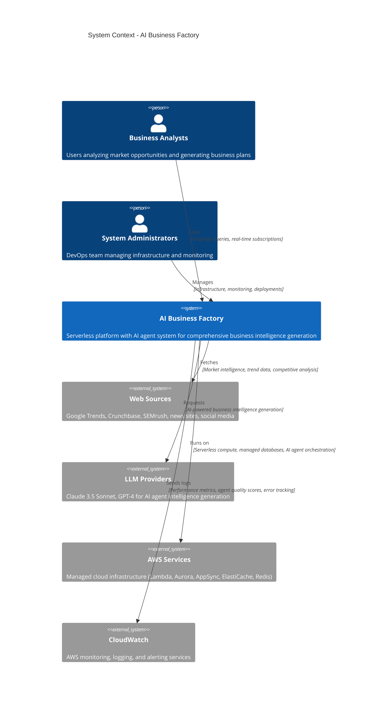
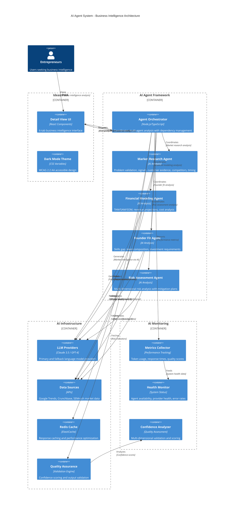
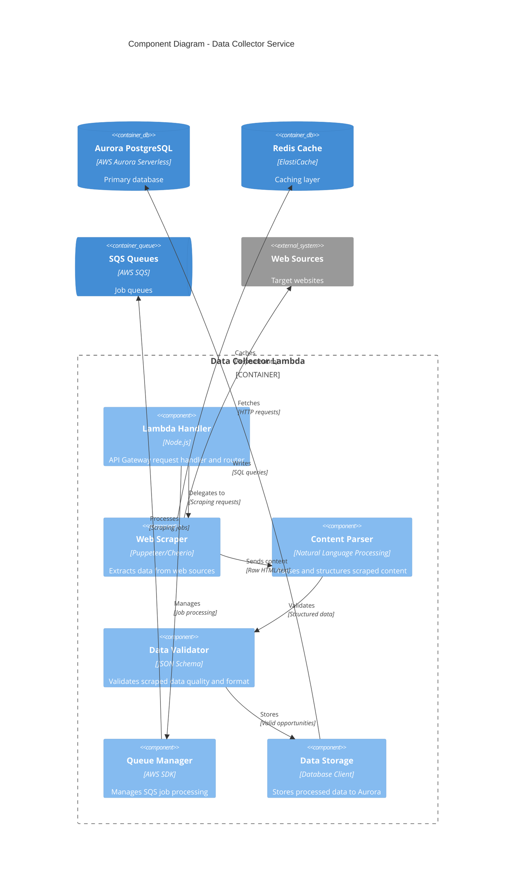
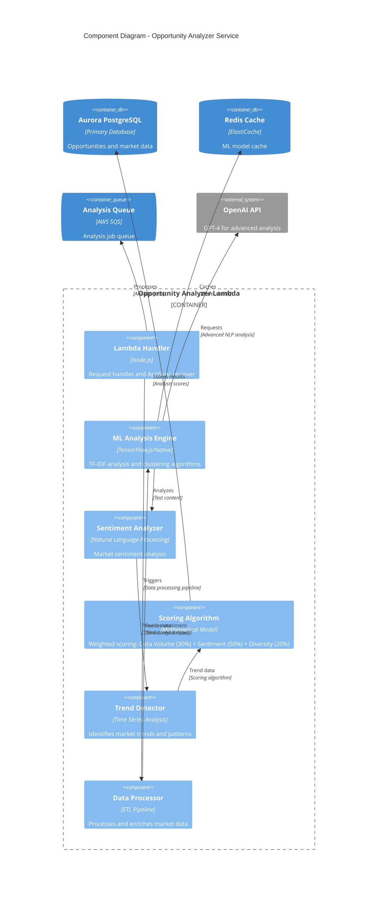
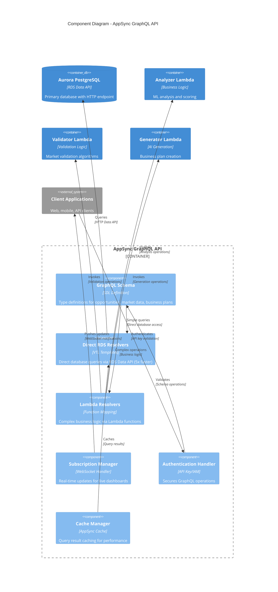
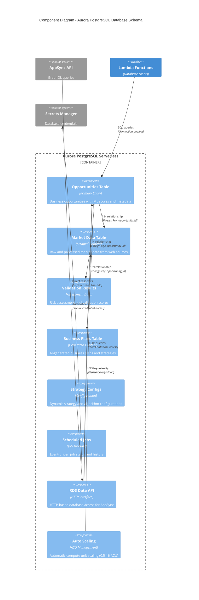
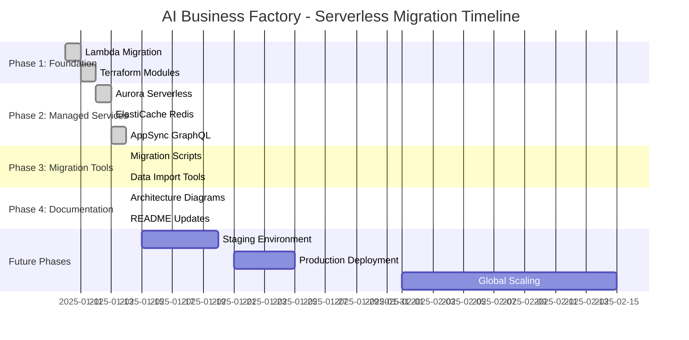

# AI Business Factory - C4 Architecture Diagrams

This document contains the C4 model architecture diagrams for the AI Business Factory serverless platform, following the hierarchical approach from system context down to component details.

**Architecture Overview**: Serverless AWS platform with AppSync GraphQL, Aurora PostgreSQL, Lambda microservices, and AI Agent Intelligence System for business opportunity analysis.

## Level 1: System Context Diagram



## Level 2: Container Diagram - Serverless Architecture

```mermaid
C4Container
    title Container Diagram - AI Business Factory Serverless Platform

    Person(user, "Business Analysts", "Platform users")
    Person(admin, "Administrators", "System operators")

    Container_Boundary(frontend, "Client Applications") {
        Container(webapp, "Web Application", "React/Next.js", "Interactive dashboard for opportunity analysis")
        Container(mobile, "Mobile App", "React Native", "Mobile access to business insights")
        Container(api_client, "API Clients", "REST/GraphQL", "Third-party integrations")
    }

    Container_Boundary(api_layer, "API Gateway Layer") {
        Container(appsync, "AppSync GraphQL API", "AWS AppSync", "Unified GraphQL endpoint with real-time subscriptions")
        Container(api_gateway, "API Gateway", "AWS API Gateway", "REST endpoints for individual services")
    }

    Container_Boundary(compute, "Serverless Compute") {
        Container(data_collector, "Data Collector", "AWS Lambda (Node.js)", "Web scraping and data collection service")
        Container(analyzer, "Opportunity Analyzer", "AWS Lambda (Node.js)", "ML-powered opportunity analysis with TF-IDF and clustering")
        Container(validator, "Market Validator", "AWS Lambda (Node.js)", "Multi-criteria market validation and risk assessment")
        Container(strategy, "Strategy Manager", "AWS Lambda (Node.js)", "Dynamic strategy management and A/B testing")
        Container(scheduler, "Scheduler", "AWS Lambda (Node.js)", "SQS-based job scheduling and orchestration")
        Container(generator, "Business Generator", "AWS Lambda (Node.js)", "AI-powered business plan generation")
    }

    Container_Boundary(data_layer, "Data & Cache Layer") {
        ContainerDb(aurora, "Aurora PostgreSQL", "AWS Aurora Serverless", "Primary database with auto-scaling and Data API")
        ContainerDb(redis, "ElastiCache Redis", "AWS ElastiCache", "Caching layer for sessions and performance optimization")
        Container(secrets, "Secrets Manager", "AWS Secrets Manager", "Secure credential and API key management")
    }

    Container_Boundary(messaging, "Event & Messaging") {
        ContainerQueue(sqs_scraping, "Scraping Queue", "AWS SQS", "Job queue for data collection tasks")
        ContainerQueue(sqs_analysis, "Analysis Queue", "AWS SQS", "Job queue for ML analysis tasks")
        ContainerQueue(sqs_validation, "Validation Queue", "AWS SQS", "Job queue for market validation")
        Container(eventbridge, "EventBridge", "AWS EventBridge", "Scheduled triggers for automation")
    }

    Container_Boundary(external, "External Services") {
        System_Ext(openai, "OpenAI API", "GPT-4 for business plan generation")
        System_Ext(web_sources, "Web Sources", "Market data sources")
        System_Ext(cloudwatch, "CloudWatch", "Monitoring and logging")
    }

    %% User interactions
    Rel(user, webapp, "Uses", "HTTPS/WebSocket")
    Rel(user, mobile, "Uses", "HTTPS/WebSocket")
    Rel(api_client, appsync, "Queries", "GraphQL over HTTPS")

    %% API layer
    Rel(webapp, appsync, "Queries", "GraphQL, real-time subscriptions")
    Rel(mobile, appsync, "Queries", "GraphQL queries/mutations")
    Rel(webapp, api_gateway, "Calls", "REST API (legacy support)")
    
    %% AppSync resolvers
    Rel(appsync, aurora, "Direct queries", "RDS Data API (5x faster)")
    Rel(appsync, analyzer, "Complex logic", "Lambda resolver")
    Rel(appsync, validator, "Business logic", "Lambda resolver")
    Rel(appsync, generator, "AI generation", "Lambda resolver")

    %% API Gateway to Lambda
    Rel(api_gateway, data_collector, "Invokes", "HTTP proxy")
    Rel(api_gateway, analyzer, "Invokes", "HTTP proxy")
    Rel(api_gateway, validator, "Invokes", "HTTP proxy")
    Rel(api_gateway, strategy, "Invokes", "HTTP proxy")
    Rel(api_gateway, scheduler, "Invokes", "HTTP proxy")

    %% Lambda to data stores
    Rel(data_collector, aurora, "Stores data", "Database connection")
    Rel(analyzer, aurora, "Reads/writes", "Analysis results")
    Rel(validator, aurora, "Stores results", "Validation data")
    Rel(strategy, aurora, "Manages configs", "Strategy settings")
    Rel(generator, aurora, "Stores plans", "Business plans")

    %% Redis caching
    Rel(data_collector, redis, "Caches", "Session data, rate limits")
    Rel(analyzer, redis, "Caches", "ML model results")
    Rel(validator, redis, "Caches", "Validation scores")

    %% Message queues
    Rel(data_collector, sqs_scraping, "Sends jobs", "Async processing")
    Rel(analyzer, sqs_analysis, "Processes", "Analysis jobs")
    Rel(validator, sqs_validation, "Processes", "Validation jobs")
    Rel(scheduler, sqs_scraping, "Schedules", "Automated jobs")
    Rel(scheduler, sqs_analysis, "Schedules", "Automated analysis")

    %% Event triggers
    Rel(eventbridge, scheduler, "Triggers", "Scheduled events")

    %% External services
    Rel(data_collector, web_sources, "Scrapes", "HTTPS requests")
    Rel(analyzer, openai, "Requests", "AI analysis")
    Rel(generator, openai, "Requests", "Business plan generation")

    %% Security and monitoring
    Rel(data_collector, secrets, "Retrieves", "API keys, DB credentials")
    Rel(analyzer, secrets, "Retrieves", "OpenAI API key")
    Rel(generator, secrets, "Retrieves", "OpenAI API key")
    Rel(compute, cloudwatch, "Logs", "Performance metrics, errors")

    %% Admin access
    Rel(admin, cloudwatch, "Monitors", "System health, costs")
    Rel(admin, aurora, "Manages", "Database administration")
```

## Level 2.5: AI Agent Intelligence System



## Level 3: Component Diagrams

### Data Collector Service Components



### Opportunity Analyzer Service Components



### AppSync GraphQL API Components



### Aurora PostgreSQL Database Schema



## Architecture Decision Records (ADRs)

### ADR-001: AppSync vs API Gateway + Lambda for GraphQL

**Decision**: Use AWS AppSync with direct RDS resolvers for GraphQL API instead of API Gateway + Lambda.

**Rationale**:
- **5x performance improvement** for simple database queries via direct resolvers
- **Cost reduction** by eliminating Lambda execution for basic CRUD operations
- **Real-time subscriptions** built-in for live dashboard updates
- **Simplified architecture** with managed GraphQL service

**Trade-offs**:
- Learning curve for VTL (Velocity Template Language) for direct resolvers
- Less flexibility than custom Lambda functions for complex transformations
- AWS vendor lock-in vs. portable GraphQL implementations

### ADR-002: Aurora Serverless v1 vs Traditional RDS

**Decision**: Use Aurora Serverless v1 with auto-pause for development environment.

**Rationale**:
- **70% cost savings** during idle periods with auto-pause
- **RDS Data API** required for AppSync direct resolvers
- **Automatic scaling** from 0.5-16 ACU based on demand
- **Zero infrastructure management** with fully managed service

**Trade-offs**:
- Cold start delays (10-30 seconds) when resuming from pause
- Limited to specific PostgreSQL versions
- Higher cost than RDS t3.micro for always-on workloads

### ADR-003: ElastiCache vs Self-Managed Redis

**Decision**: Use AWS ElastiCache Redis for caching layer.

**Rationale**:
- **Managed service** with automatic patching and maintenance
- **High availability** with Multi-AZ support
- **Performance monitoring** built-in with CloudWatch
- **Security integration** with VPC and IAM

**Trade-offs**:
- Higher cost than self-managed Redis on EC2
- Less control over Redis configuration and modules
- AWS region dependency for data locality

### ADR-004: AI Agent System for Business Intelligence Generation

**Decision**: Implement sophisticated AI agent framework for comprehensive business intelligence generation.

**Rationale**:
- **Revolutionary user experience** transforming simple ideas into enterprise-grade analysis
- **Competitive differentiation** through AI-powered market intelligence
- **Scalability** supporting unlimited automated analysis vs. manual research
- **Quality assurance** with multi-dimensional confidence scoring
- **Modular architecture** enabling rapid expansion with additional agents

**Trade-offs**:
- Increased operational complexity and LLM API costs
- External dependencies on LLM providers and market data sources
- Quality management requiring ongoing validation improvements
- Higher infrastructure requirements for caching and monitoring

**Implementation Status**: Phase 1 complete with Market Research Agent achieving 87% confidence

## Deployment Architecture

```mermaid
C4Deployment
    title Deployment Diagram - AI Business Factory (AWS us-east-1)

    Deployment_Node(aws, "AWS Cloud", "Amazon Web Services") {
        Deployment_Node(lambda_env, "Lambda Environment", "Serverless Compute") {
            Container(data_collector_deploy, "Data Collector", "Lambda Function", "1024MB, 300s timeout")
            Container(analyzer_deploy, "Opportunity Analyzer", "Lambda Function", "2048MB, 900s timeout")
            Container(validator_deploy, "Market Validator", "Lambda Function", "1024MB, 600s timeout")
            Container(strategy_deploy, "Strategy Manager", "Lambda Function", "512MB, 60s timeout")
            Container(scheduler_deploy, "Scheduler", "Lambda Function", "512MB, 60s timeout")
            Container(generator_deploy, "Business Generator", "Lambda Function", "2048MB, 900s timeout")
        }

        Deployment_Node(api_layer_deploy, "API Layer", "Managed API Services") {
            Container(appsync_deploy, "AppSync GraphQL", "Managed GraphQL API", "API Key authentication")
            Container(api_gateway_deploy, "API Gateway", "REST API", "6 service endpoints")
        }

        Deployment_Node(data_tier, "Data Tier", "Managed Databases") {
            ContainerDb(aurora_deploy, "Aurora PostgreSQL", "Serverless v1", "0.5-1 ACU, auto-pause")
            ContainerDb(redis_deploy, "ElastiCache Redis", "t3.micro", "Single node cluster")
        }

        Deployment_Node(messaging_deploy, "Event & Messaging", "Async Processing") {
            ContainerQueue(sqs_deploy, "SQS Queues", "3 queues + DLQ", "Standard queues")
            Container(eventbridge_deploy, "EventBridge", "Scheduled Rules", "Hourly/daily triggers")
        }

        Deployment_Node(security_deploy, "Security & Secrets", "Managed Security") {
            Container(secrets_deploy, "Secrets Manager", "Credential Store", "Database and API keys")
            Container(iam_deploy, "IAM Roles", "Access Control", "Least-privilege policies")
        }

        Deployment_Node(monitoring_deploy, "Monitoring", "Observability") {
            Container(cloudwatch_deploy, "CloudWatch", "Logs & Metrics", "14-day retention")
            Container(xray_deploy, "X-Ray Tracing", "Distributed Tracing", "Planned for production")
        }
    }

    Deployment_Node(terraform, "Infrastructure as Code", "Terraform") {
        Container(terraform_modules, "Terraform Modules", "7 reusable modules", "Complete infrastructure definition")
        Container(environments, "Environments", "dev/staging/prod", "Environment-specific configurations")
    }

    Rel(terraform_modules, lambda_env, "Deploys", "Infrastructure provisioning")
    Rel(terraform_modules, data_tier, "Provisions", "Managed databases")
    Rel(terraform_modules, api_layer_deploy, "Creates", "API endpoints")
```

## Migration Timeline



---

## Diagram Maintenance

**Update Policy**: These diagrams MUST be updated whenever architectural changes are made.

**Responsibility**: Developer making architectural changes updates corresponding diagrams.

**Review Process**: Architecture changes require diagram review in pull requests.

**Tools**: 
- **Mermaid**: For C4 diagrams (GitHub native support)
- **PlantUML**: Alternative for complex diagrams
- **Draw.io**: For visual architecture presentations

**Last Updated**: January 14, 2025 - Serverless Migration Complete

---

*These C4 architecture diagrams document the complete transformation from Docker microservices to AWS serverless architecture with AppSync GraphQL integration, Aurora Serverless, and comprehensive cost optimization.*